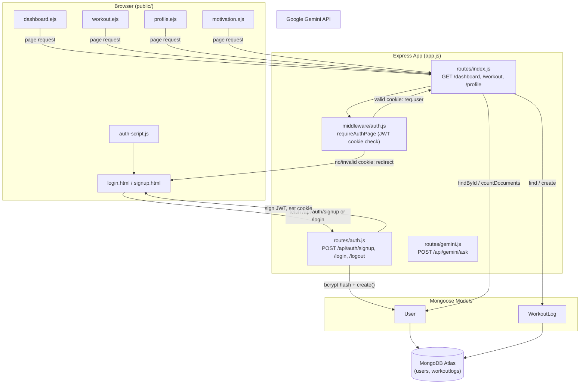

# LevelUp-GenAI
A full-stack AI-powered personal fitness tracking platform using Nodejs, JavaScript, Google FastAPI, MangoDb, and Google's Gemini API. Implemented secure JWT authentication, interactive dashboards, personalized workout based on users data. An experience system (xp) that levels up the user based on workout and other workout done. This feature keeps the users engaged and coming back for more    

#########################################
https://levelup-ai-0hbx.onrender.com
#########################################

#####################################
Testing Info:
email: andreking123@gmail.com
password: 123456789
#####################################

#####################################
API: Google API
#####################################

#####################################
DATABASE: mangoDB
SCHEMA: LevulUp
#####################################

#####################################
Deployed using RENDER
#####################################

## LevelUp Mermaid diagram

    Dashboard -- "click Ask Gemini" --> GeminiRoute
    GeminiRoute -- "recent stats" --> WorkoutModel
    GeminiRoute -- "generateContent" --> GeminiAPI
    GeminiAPI -- "AI reply" --> GeminiRoute
    GeminiRoute -- "JSON reply" --> Dashboard
